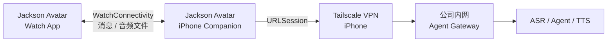

# Jackson Avatar 产品需求文档

> 状态：MVP 已完成；iPhone Relay 网络改造待实现  
> 更新日期：2026-07-30  
> 适用端：Apple Watch + iPhone Companion App

## 01 / WHY：为什么必须经过 iPhone

Jackson Avatar 是运行在 Apple Watch 上的语音个人助理。用户在手表上说话，系统完成 ASR、调用公司内网 Agent、执行工具并通过 TTS 返回结果。

真正的限制不是 Watch 能不能联网，而是公司 Agent 只能从公司网络访问。进入公司网络依赖 iPhone 上的 Tailscale，Watch 自己的 Wi-Fi、蜂窝网络或系统自动选择的网络路径都不能作为可信入口。

因此，产品必须满足一个硬约束：

> 所有公司 Agent 请求都由 iPhone Companion App 发起。Watch 只和已配对的 iPhone 通信，不直接访问公司内网。

### 成功标准

- 用户从 Watch 发起一轮语音后，不需要拿出手机即可获得结果。
- 每个公司 Agent 请求都能证明由 iPhone Relay 发起并经过 iPhone 的 Tailscale。
- iPhone 或 Tailscale 不可用时，Watch 明确提示原因，绝不偷偷改走公网直连。
- 发送、删除、付款、改权限等高风险操作仍需在 Watch 上二次确认。
- 网络恢复后可以安全重试，不会重复执行同一条 Agent 操作。

## 02 / SCOPE：这次做什么

### MVP 范围

- Watch 录音、交互状态、历史对话、风险确认、撤回和结果播放。
- Watch 与 iPhone 之间使用 `WatchConnectivity`。
- iPhone Relay 通过 `URLSession` 调用公司内网 Gateway。
- iPhone 上的 Tailscale 负责把 Gateway 请求路由到公司网络。
- 文本和状态使用即时消息；录音与 TTS 音频使用二进制消息或文件传输。
- iPhone 保存公司 Gateway 地址和凭证，Watch 不保存公司内网 Token。

### 暂不包含

- Watch 自己安装或运行 Tailscale。
- Watch 直接访问公司 Agent 的降级链路。
- 常驻唤醒词。
- 第一版即支持全双工、可打断的实时语音流。
- iPhone 作为通用 TCP、SOCKS 或 HTTP 系统代理。

## 03 / USER STORIES：用户真正遇到的三种情况

### 故事一：正常语音请求

1. 用户在 Watch 点击说话并完成一句录音。
2. Watch 显示“正在连接 iPhone”，把录音和请求 ID 发给 iPhone。
3. iPhone Relay 经 Tailscale 调用 ASR、Agent 和 TTS。
4. Watch 依次显示识别文本、执行状态和最终回复，并播放 TTS。
5. 本轮对话写入 Watch 和 iPhone 的历史列表。

结果：用户只操作手表，但公司内网请求实际由 iPhone 发出。

### 故事二：iPhone 或 Tailscale 不可用

1. 用户完成录音。
2. Watch 发现 Companion App 不可达，或 iPhone Relay 返回 Tailscale/Gateway 不可达。
3. Watch 保留本轮录音的短期重试状态，并明确提示“请靠近并解锁 iPhone”或“iPhone 未连接公司网络”。
4. 系统不改用 Watch 自身网络访问公司 Agent。

结果：失败原因可理解、可恢复，也不会绕过公司网络边界。

### 故事三：高风险操作

1. 用户说“把总结发到项目群”。
2. iPhone Relay 获取 Agent 返回的确认卡片。
3. Watch 展示目标、影响和操作按钮。
4. 用户在 Watch 确认后，确认请求再次经过 iPhone Relay。
5. Gateway 校验一次性 `confirmation_id` 后才执行。

结果：网络代理不会削弱现有的风险确认机制。

## 04 / HOW：目标网络架构



### 设计原则

1. **iPhone 是唯一公司网络出口**  
   Watch 不保存公司 Endpoint 或 Token，也不直接请求公司地址。

2. **先确认收到，再等待结果**  
   iPhone 收到请求后先返回 `request_id` 和接收状态。耗时任务异步完成，避免一次即时消息等待 ASR、Agent、TTS 全链路而超时。

3. **网络断了就说清楚**  
   Watch 区分“找不到 iPhone”“Tailscale 未连接”“Gateway 超时”“Agent 执行失败”，不统一显示成“网络错误”。

4. **每次执行都可去重**  
   `request_id`、`turn_id`、`confirmation_id` 和 `undo_id` 都必须具备幂等语义，重连或重试不能造成重复发送。

## 05 / MVP FLOW：一轮语音怎样跑完

### 5.1 提交语音

1. Watch 生成全局唯一 `request_id`，录制最长 30 秒的单声道 AAC/M4A。
2. Watch 检查 `WCSession.activationState == .activated` 和 `isReachable == true`。
3. 小文件优先使用 `sendMessageData`；超过即时消息承载能力时使用 `transferFile`。
4. iPhone Relay 验证请求格式，立即返回：

```json
{
  "request_id": "req_123",
  "state": "accepted"
}
```

5. iPhone 使用 Keychain 中的 Token，通过 `URLSession` 请求公司 Gateway。
6. iPhone 将处理中、需确认、已完成或失败状态发回 Watch。
7. Watch 更新界面、保存历史并播放返回的 TTS。

### 5.2 长任务

- Gateway 超过 8 秒不能完成时返回 `running + task_id`。
- 后续轮询由 iPhone Relay 发起，Watch 不直接轮询公司 Gateway。
- Watch 离开前台时，iPhone 保存任务状态；恢复连接后同步最新结果。

### 5.3 确认、撤回和取消

以下请求都必须复用同一条 Relay 链路：

- `confirm(confirmation_id, approved)`
- `undo(undo_id)`
- `task(task_id)`
- `cancel(task_id)`

Watch 只表达用户意图；iPhone Relay 发出网络请求；Gateway 负责最终权限和幂等校验。

## 06 / COMPONENTS：两端各自负责什么

| 组件 | 责任 | 不负责 |
|---|---|---|
| Watch UI | 录音、状态反馈、风险确认、历史列表、TTS 播放 | 公司网络连接、保存公司 Token |
| Watch Relay Client | 封装请求、请求 ID、可达性检测、重试状态 | 直接调用 Gateway |
| iPhone Relay | 接收 Watch 请求、调用 Gateway、回传状态和音频 | 替代服务端权限校验 |
| iPhone Settings | Gateway 地址、Token、Tailscale 健康检查 | 把公司 Token 同步给 Watch |
| Agent Gateway | ASR、Agent、工具、TTS、幂等和审计 | 信任客户端已做风险确认 |

### Relay 消息最小字段

```json
{
  "version": 1,
  "request_id": "req_123",
  "operation": "submit_turn",
  "created_at": "2026-07-30T08:30:00Z",
  "payload": {}
}
```

`operation` 第一版包含：

- `submit_turn`
- `confirm`
- `get_task`
- `cancel_task`
- `undo`
- `sync_history`
- `health_check`

## 07 / FAILURE STATES：失败时用户看到什么

| 判断条件 | Watch 提示 | 是否自动重试 |
|---|---|---|
| `WCSession` 未激活 | 正在连接 iPhone | 激活后重试一次 |
| `isReachable == false` | 请靠近并解锁 iPhone | 用户点击重试 |
| iPhone Tailscale 不可用 | iPhone 未连接公司网络 | 不自动直连 |
| Gateway 超时 | 公司 Agent 暂时无响应 | 使用同一 `request_id` 重试 |
| Agent 返回 401/403 | 公司账号需要重新登录 | 不重试 |
| TTS 文件传输延迟 | 文字已返回，语音稍后播放 | 后台继续传输 |

## 08 / SECURITY：不能被实现细节破坏的边界

- 公司 Gateway 地址和 Bearer Token 只保存在 iPhone Keychain。
- Watch 与 iPhone 使用系统配对的 `WatchConnectivity`，不自建局域网监听端口。
- Release 环境只允许 HTTPS Gateway。
- 日志不得记录 Token、完整原始语音或敏感 Agent 参数。
- iPhone Relay 必须记录 `request_id`、时间、操作类型和脱敏结果，便于排错。
- 高风险工具调用必须由 Gateway 再次验证确认 ID。
- Tailscale 不可用时禁止 Watch 公网直连公司 Endpoint。

## 09 / ACCEPTANCE：怎么知道改造完成

- [ ] 关闭 Watch Wi-Fi、保持 iPhone Tailscale 在线，语音请求仍成功。
- [ ] 关闭 iPhone Tailscale 后，请求失败且 Watch 显示“iPhone 未连接公司网络”。
- [ ] iPhone Companion App 不在前台时，Watch 能唤醒并完成一轮短请求。
- [ ] iPhone 重启后未解锁时，Watch 明确提示 iPhone 不可达。
- [ ] 同一 `request_id` 连续发送两次，Gateway 只执行一次。
- [ ] 高风险操作未确认时，Gateway 不执行工具。
- [ ] TTS 音频回传失败时，文字结果仍可查看并可手动重试播放。
- [ ] 历史对话在 Watch 和 iPhone 上最终一致。

### 观测指标

| 指标 | 定义 | MVP 判断标准 |
|---|---|---|
| Relay 可达率 | Watch 发起时 `isReachable` 为真的比例 | 用真机记录基线 |
| 首次响应耗时 | 点击结束录音到收到 `accepted` | P95 小于 2 秒 |
| 整轮耗时 | 结束录音到文字结果可见 | 按 ASR/Agent/TTS 分段统计 |
| 重复执行数 | 相同请求导致多次工具执行 | 必须为 0 |
| 错误可解释率 | 错误能归入明确失败状态的比例 | 100% |

## 10 / 当前实现与改造项

当前 MVP 已具备录音、Agent 协议、风险确认、历史对话和 iPhone Companion，但云端模式仍由 Watch 中的 `CloudAgentService` 直接请求 Gateway。

进入公司内网前必须完成以下改造：

- [ ] 新增 Watch `RelayAgentService`，替换公司模式下的直接 `URLSession`。
- [ ] 扩展 iPhone `PhoneConnectivity`，接收并代理全部 Agent 操作。
- [ ] Endpoint 和 Token 改为只存 iPhone，不再同步到 Watch。
- [ ] 增加 Tailscale/Gateway 健康检查和明确错误码。
- [ ] 增加请求幂等、异步状态回传及音频文件回传。
- [ ] 增加断连、锁屏、Tailscale 关闭和重复请求真机测试。
